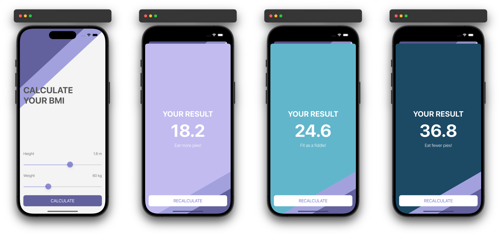

# BMI Calculator

## Introduction

This BMI (Body Mass Index) Calculator is a simple and intuitive iOS application built using Swift and UIKit. It allows users to input their height and weight using sliders, calculates their BMI, and provides relevant health advice based on the calculated BMI. The result is displayed with a color-coded background indicating the BMI category.

### Preview

  

## Features

- **Height and Weight Sliders**: Users can easily adjust their height and weight using sliders.
- **BMI Calculation**: The application calculates the BMI based on the input height and weight.
- **Result Display**: Displays the calculated BMI, health advice, and a color-coded background indicating the BMI category.
- **Recalculate Option**: Users can go back to the input screen to recalculate their BMI.

## Code Structure

### CalculateViewController

This view controller manages the input screen where users can adjust their height and weight using sliders. It includes methods to update labels as sliders change, calculate BMI, and prepare for segue to the result screen.

### ResultViewController

This view controller manages the result screen where the calculated BMI, advice, and a color-coded background are displayed. It initializes the view with BMI results and provides an option to recalculate BMI.

## Conclusion

The BMI Calculator is a straightforward iOS application that provides users with an easy way to calculate their BMI and receive relevant health advice. By adjusting the height and weight sliders, users can quickly determine their BMI and understand their health status through color-coded results and advice. This project is a great example of using Swift and UIKit to build user-friendly mobile applications.
